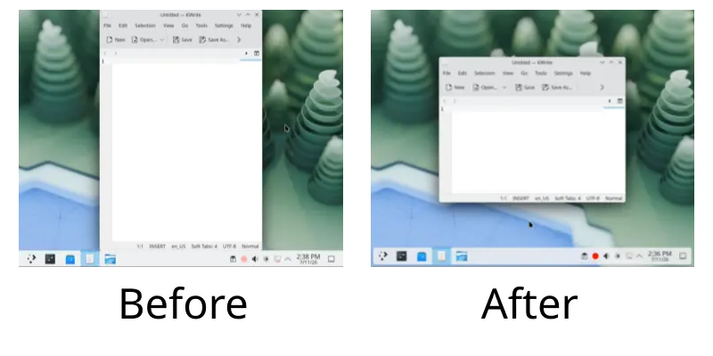

# kwin-pretile-restore

A KWin plugin for KDE Plasma 6 (Wayland) that restores floating ("normal") window size after being closed in a tiled state.

(Click the image below to see an animated demo)



## The problem

If you reopen an app you tiled last time, the new window often retains the tiled window size, which is quite inconvenient. To be fair, MS Windows treats a tiled state like a maximized state, so querying window geometry for saving reports the floating size. In KDE Plasma, querying window geometry reports the literal window size, which makes apps store the tiled window size instead.

## How it works

This plugin watches windows being closed and opened and manually restores the size from its own saved list.

- **On close:** If the window was tiled, its floating geometry is saved and marked for restore. If it was not tiled, the mark is cleared.
- **On open (primary):** If it was marked for restore, the new window is resized back to the saved geometry right after it opens.
- **On open (secondary):** Some programs even save their window size while it's running, so it checks if any opened window has a tiled state. If it finds the new window's geometry is the same as the tiled one, it restores the saved geometry even if it's not marked.

The list is at `~/.config/kwinpretilerestorerc`, one entry per app.

## Build & install

### Requirements

- KDE Plasma 6 on Wayland
- KWin 6.x (bundled with KDE Plasma 6)

To check your KWin version: `kwin_wayland --version`

### Tested on

- Kubuntu 26.04 LTS with KWin 6.6.4 / 6.6.5
- Arch Linux with KWin 6.6.5
- Fedora 40 KDE Spin with KWin 6.0.0

### Build dependencies

| Distribution | Command |
|---|---|
| **Arch Linux (CachyOS)** | `sudo pacman -S base-devel cmake pkgconf extra-cmake-modules qt6-base kwin kconfig kwindowsystem` |
| **Debian (Ubuntu)** | `sudo apt install build-essential cmake pkg-config extra-cmake-modules kwin-dev libkf6config-dev libkf6windowsystem-dev qt6-base-dev` |
| **Fedora** | `sudo dnf install gcc-c++ cmake pkgconf extra-cmake-modules kwin-devel kf6-kconfig-devel kf6-kwindowsystem-devel qt6-qtbase-devel` |
| **openSUSE** | `sudo zypper install gcc-c++ cmake pkgconf extra-cmake-modules kwin6-devel kf6-kconfig-devel kf6-kwindowsystem-devel qt6-base-devel` |

### Installation scripts

To install it:

```bash
./install.sh
```

After it completes, log out and back in. (KWin only loads plugins at startup)

Note that you'll have to run this install script after each KWin upgrade since KWin rejects any plugins not matching its version number.

To remove it:

```bash
./uninstall.sh
```

## Debugging

Add to `~/.config/QtProject/qtlogging.ini`:

```ini
[Rules]
kwin.pretilerestore*=true
```

Log out and back in, then watch:

```bash
journalctl --user _COMM=kwin_wayland -f
```

## License

GPL-2.0+
